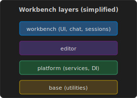

## Module 3 — Architecture & core surfaces

**Rendered Markdown:** [Preview Copilot / architecture instructions](command:engineeringTutorial.previewCopilotInstructions)

Maintainable editors use **layers** and **extension boundaries** so features do not collapse into one ball of mud.

### Read in the repo

- [copilot-instructions.md](command:engineeringTutorial.openCopilotInstructions) — maps `base` → `platform` → `editor` → `workbench`, extensions, and validation habits.

Skim on disk:

- `education/architecture-and-core/agent-host/` — how agentic features tie into the platform.
- `education/architecture-and-core/vscode-dts/` — stable vs proposed **Extension API** typings.

### Practice

In any TypeScript/JavaScript project, open **Outline** or **Go to Symbol** and notice how **module boundaries** match team ownership—same idea as VS Code layers.

### Link to SE practice

**Architecture decision records** in your own projects play the same role as these internal docs: explain *why* structure exists.
