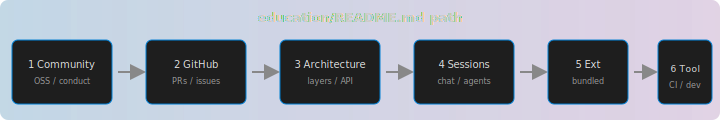

## Module 4 — Sessions, chat & agents

**Rendered Markdown:** [Preview sessions README](command:engineeringTutorial.previewSessionsReadme)

The workbench is extending from **files + terminal** toward **conversations and agents** that share context with the editor.

### Read in the repo

- [sessions/README.md](command:engineeringTutorial.openSessionsReadme)

Then browse:

- `education/sessions-chat-and-agents/sessions/skills/` — skills described as operational playbooks (commit, PR, sync, …).
- `education/sessions-chat-and-agents/workbench-chat/` — how chat contributions are organized.

### Practice

When you use **Chat** or **Agent** features in your editor, notice: **scope** (selection vs workspace), **tools** (terminal, search), and **traceability** (what changed)—the same concerns as code review.

### SE takeaway

**Agent workflows still need review, tests, and PR discipline**—they amplify speed, not responsibility.
